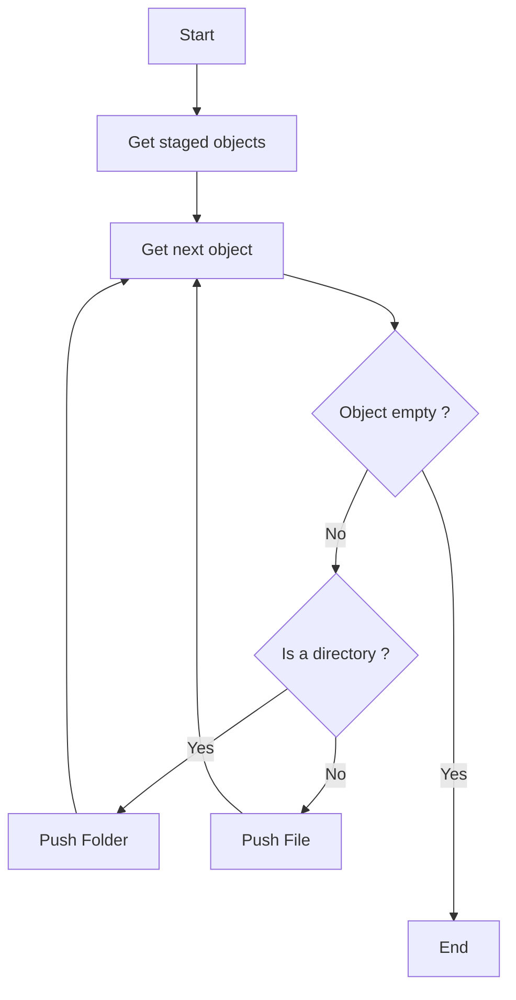
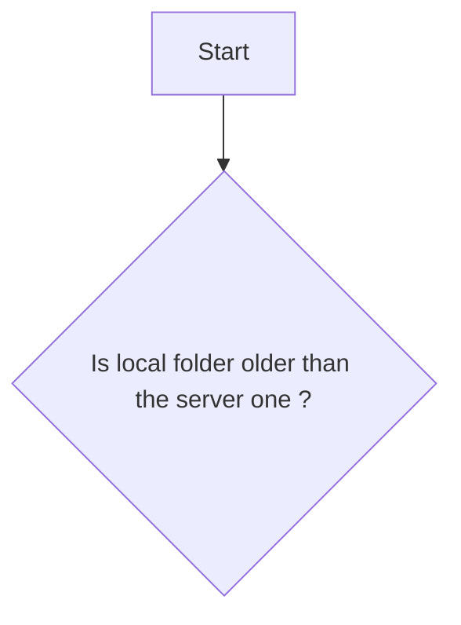

## Push

```mermaid
flowchart TD
    A[Start] --> G[Get staged objects]
    G --> GNO[Get next object]
    GNO --> H{Object empty ?}
    H --> |No| B{Is a directory ?}
    H ----> |Yes| F[End]
    B --> |Yes| C[Push Folder]
    B --> |No| E[Push File]
    C --> GNO
    E --> GNO
```

## Pushing a folder

```mermaid
flowchart TD
    A[Start] --> B{Is local folder older than the server one ?}
    

```

## Pushing a file

```mermaid


```